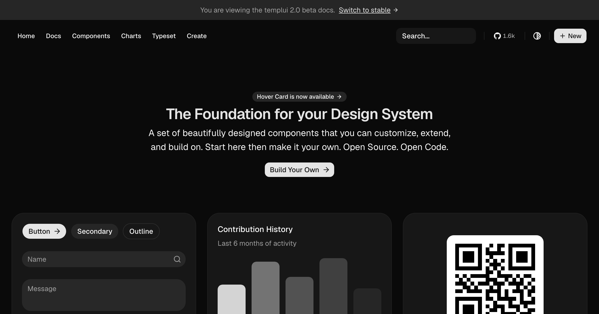

# shadcn-templ

shadcn/ui for templ. A set of beautifully designed components that you can customize, extend, and build on. Start here then make it your own. Open Source. Open Code. **Use this to build your own component library.**

shadcn-templ is an unofficial, community-led port of [shadcn/ui](https://ui.shadcn.com) for Go and templ. We are not affiliated with [shadcn](https://x.com/shadcn), but we did get his blessing before creating this project.

## Documentation

Visit https://shadcn-templ.com/docs to view the documentation.

## Contributing

Please read the [contributing guide](/CONTRIBUTING.md).

## License

Licensed under the [MIT license](./LICENSE).
