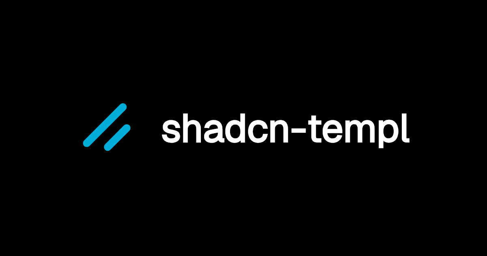

# templui

shadcn/ui for templ. A set of beautifully designed components that you can customize, extend, and build on. Start here then make it your own. Open Source. Open Code. **Use this to build your own component library.**

## Documentation

Visit https://templui.io/docs to view the documentation.

## Contributing

Please read the [contributing guide](/CONTRIBUTING.md).

## License

Licensed under the [MIT license](./LICENSE).
